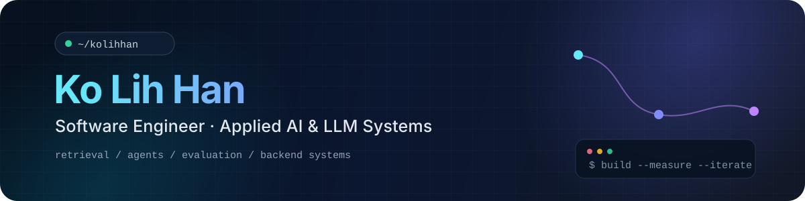

<p align="center">
  
</p>

<p align="center">
  <strong>Software engineer building applied AI systems that retrieve, reason, use tools, and hold up under real software constraints.</strong>
</p>

<p align="center">
  
</p>

---

## About

I work across **applied AI, LLM systems, retrieval, agents, and backend engineering**. I like building the full path around a model — APIs, retrieval, tool use, evaluation, failure handling, and the production details that make a system usable.

Before focusing on AI, I spent several years building and maintaining **Laravel / Vue** applications in production. I am finishing my master's at **National Tsing Hua University**, where my research studies how workplace relationships and conversational context affect implicit meaning in dialogue.

## Selected work

<table>
<tr>
<td width="33%" valign="top">

### 🧠 Semantic Text-to-SQL

Local NL → SQL with **LangGraph + FastAPI + SQLite**.

Generate → verify → bounded repair → read-only execute.

**Frozen 100-query BIRD DEV slice**  
`31% → 34%` official EX  
`63% → 82%` execution success

<a href="https://github.com/kolihhan/semantic-text2sql-agent"><strong>View project →</strong></a>

</td>
<td width="33%" valign="top">

### 🔎 Local RAG Search

Local hybrid retrieval with **BM25 + Qwen embeddings + RRF**.

Search results expose lexical, dense, and final fusion rank provenance.

**64-query Confluence slice**  
`0.7630` Recall@10  
`0.7418` MRR@20

<a href="https://github.com/kolihhan/local-rag-search"><strong>View project →</strong></a>

</td>
<td width="33%" valign="top">

### 🎬 Hermes Video Tutor

Multimodal QA agent that decides when to search transcripts or inspect video evidence.

**12-case paired evaluation**  
`66.7%` visual-required full pass  
`100%` visual tool use on visual questions

<a href="https://github.com/kolihhan/hermes-video-tutor"><strong>View project →</strong></a>

</td>
</tr>
</table>

## Engineering focus

```text
Applied AI      LLMs · RAG · hybrid retrieval · agents · tool use
Backend         Python · FastAPI · REST APIs · SQLite · queues
Evaluation      benchmark design · failure analysis · reproducible runs
Production      Laravel · Vue.js · deployments · maintenance
```

## Background

**M.S., National Tsing Hua University** — research on context-aware implicit meaning in workplace dialogue.  
**Software engineering** — production web systems, backend workflows, deployments, and maintenance before moving deeper into applied AI.

---

<p align="center">
  <code>build → measure → inspect failures → improve</code>
</p>
